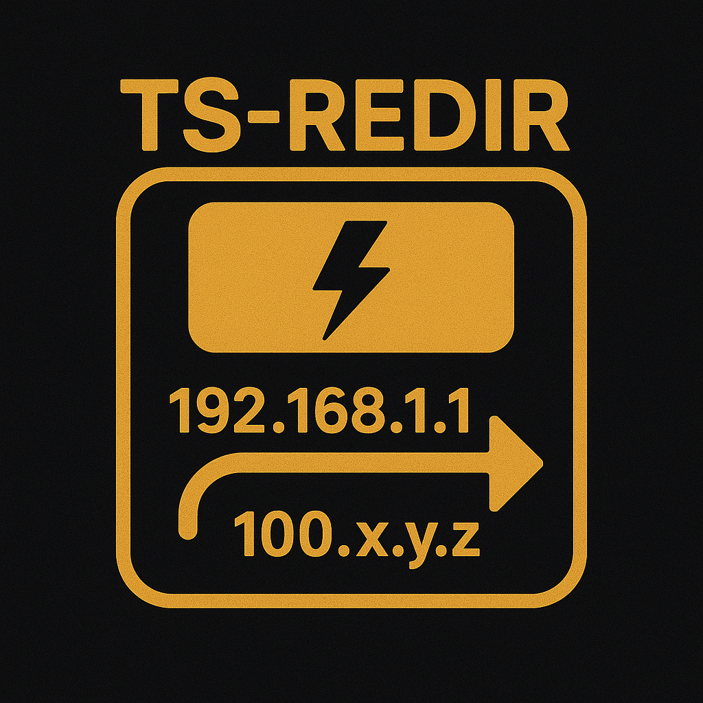

# ts-redir

`ts-redir` is a terminal user interface for managing nftables redirect rules that forward traffic into a Tailscale tailnet. It combines the [`github.com/google/nftables`](https://pkg.go.dev/github.com/google/nftables) library with the Bubble Tea framework to provide an interactive workflow for creating and deleting DNAT rules that point traffic at Tailscale peers.

## Disclaimer

This project is not affiliated with Tailscale the company. This is a personal project that I have been developing in order to solve a problem I sometimes have.

## Reasoning

I have found myself from time to time wanting to use my tailnet not for the subnet routing feature but in the reverse direction. To be able to direct non-tailnet traffic into my tailnet. While Tailscale Funnel can do this, I don't necessarily want it public and would prefer a generic ip forwarding rule instead of a full reverse-proxy. By forwarding traffic into the tailnet as a router might, I am able to have a device (such as a raspberry pi) sit on a LAN but be able to proxy traffic over a tailnet. By doing so, no other devices on that LAN technically need to have tailscale installed in order to proxy traffic over the tailnet that exposes a port on the device.

## Features

- Discover Tailscale peers via the local `tailscale status --json` command.
- Create IPv4 DNAT rules that match a destination IP/port and forward them to a peer/port, with automatic postrouting masquerade so return traffic reaches the client.
- List and remove existing rules that were created through the application.
- Automatically ensures the `ip ts_redir` table and `prerouting`, `postrouting`, and `output` chains exist.

## Requirements

- Linux host with nftables support and privileges to add NAT rules (typically root).
- Tailscale CLI installed and authenticated (for peer discovery).
- ip_forwarding enabled on the Linux host.
    - `sudo sysctl net.ipv4.ip_forward=1`
    - For persistent ip forwarding:
        - `echo "net.ipv4.ip_forward=1" | sudo tee -a /etc/sysctl.conf`
- Go 1.24 or newer if building from source.

## Running

The program must access nftables, so you usually need to run it with sufficient privileges (e.g. via `sudo`).

```bash
sudo go run ./cmd/ts-redir/main.go
```

Within the UI:

- `a` — add a new redirect rule
- `d` — delete the selected rule
- `r` — refresh nftables rules
- `p` — refresh Tailscale peer list
- `q` — quit

Rules are stored with metadata inside nftables `UserData`, so only rules created through `ts-redir` will appear in the list.
